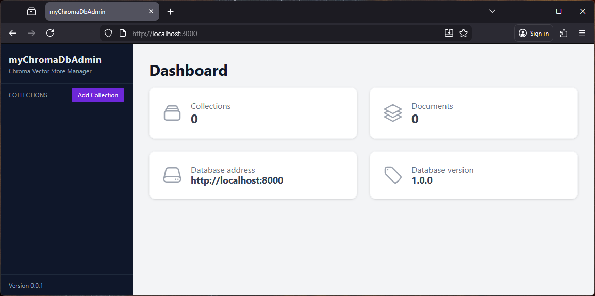
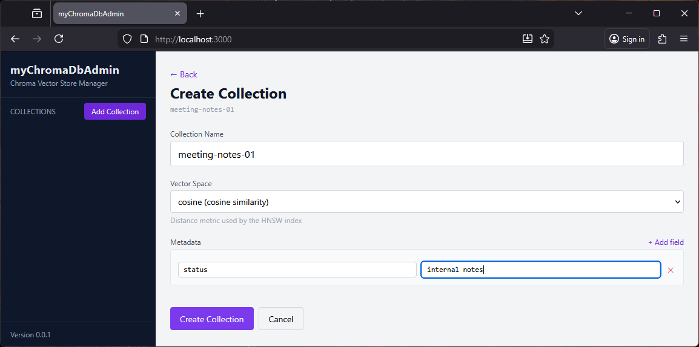
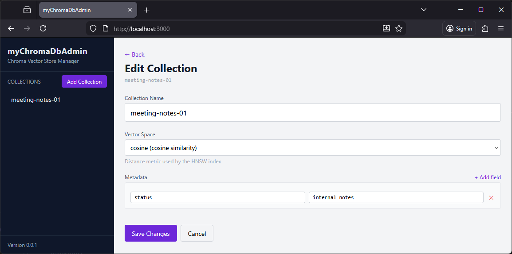
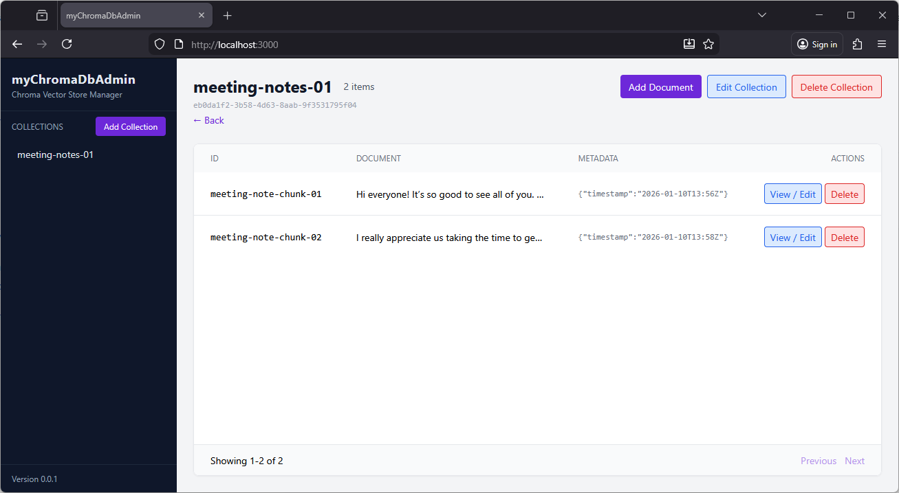
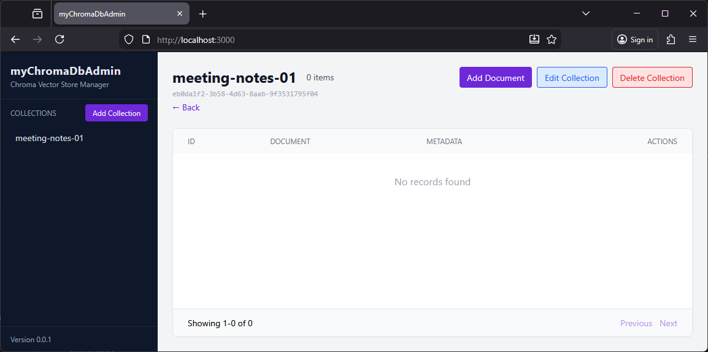
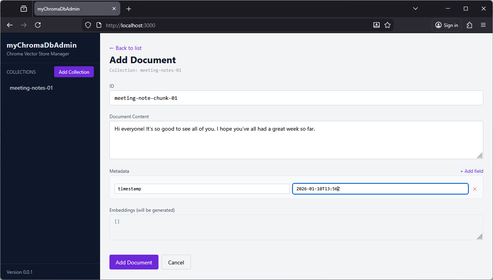
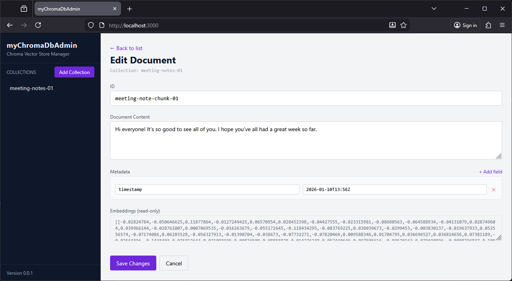
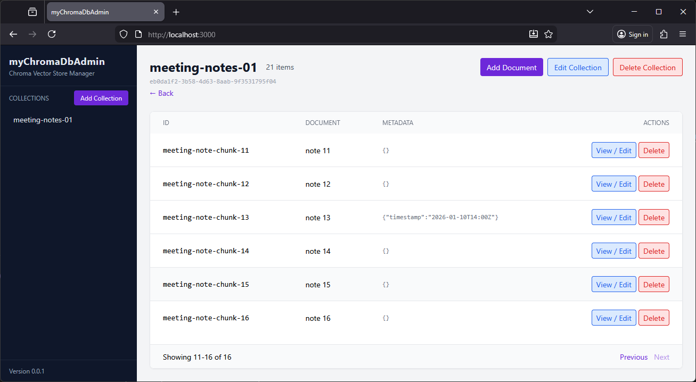
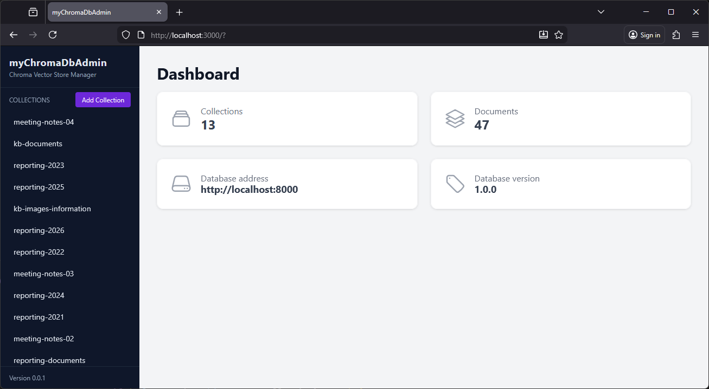
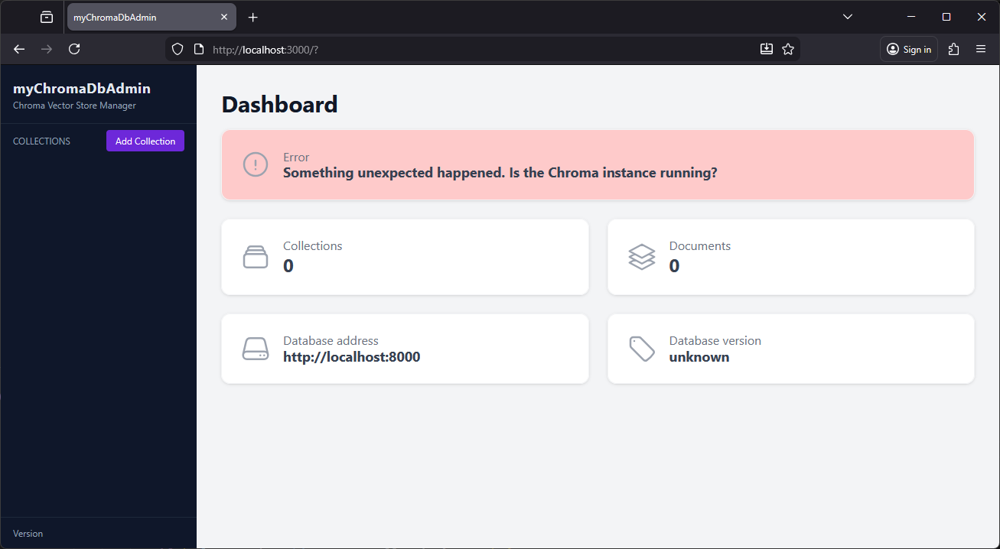

# myChromaDbAdmin

**Simple user-friendly Chroma database administration WebUI.**

## Disclaimer
This is an independent personal project not affiliated with or sponsored by [Chroma](https://www.trychroma.com/).

## Overview

The myChromaDbAdmin is a webpage that helps you navigate, manage, and interact with your data stored in the Chroma database.

## Why is it called myChromaDbAdmin?
The name **myChromaDbAdmin** is directly inspired by [phpMyAdmin](https://www.phpmyadmin.net/), a tool I frequently use and admire. Just as phpMyAdmin provides a powerful web interface for managing MySQL/MariaDb databases, this app aims to provide the same ease of use and accessibility for ChromaDB. 🙂

## Prerequisites

- A running instance of Chroma database. You can find installation instructions on the [Chroma GitHub Repository](https://github.com/chroma-core/chroma).

## Features

- View and manage (create, delete, rename) collections and collections metadata in your Chroma database.
- Browse and manage (add, edit, clone, delete) documents content and metadata within collections.

## Tech Stack

- Frontend: 
    - HTML (EJS)
    - CSS (Tailwind CSS)
    - JavaScript (Alpine.js)
- Backend: 
    - Node.js
    - Express.js
    - The Chroma [npm package](https://docs.trychroma.com/docs/overview/getting-started?lang=typescript)

## Motivation
While working with ChromaDb locally, I found that the official TUI client had several limitations: 

- it can only open one collection at a time from a local instance
- it lacks the ability to modify existing collections or documents

I developed this web app to provide a more flexible solution for browsing, inspecting, and managing vector store content directly from a browser.

## Installation

1. Clone the repository and install the dependencies:
   ```bash
    npm install
    ```
2. Start the application:
   ```bash
   npm run start
   ```
3. Open your web browser and navigate to `http://localhost:3000` to access the myChromaDbAdmin interface.

## Usage and features

The home screen consists currently of two main areas:

- Sidebar (left): displays a list of all available collections.
- Main panel (right): displays the dashboard, document lists, and configuration dialogs. 

Upon loading, the application defaults to the Dashboard, witch provides a high-level overview of the connected instance. 



### Managing collections

To create a new collection use the **create collection** dialog.



You can modify an existing collection to rename it or update its metadata.

**Please note:** *The distance function (space configuration) can only be set during creation. It cannot be changed once the collection has been created.*



### Viewing documents

When you select a collection from the sidebar, the main panel displays all documents within that collection.



If the selected collection contains no data, the list will appear empty.



### Adding and Editing Documents

Documents can be added manually to any collection. Please note that embeddings are generated automatically by the server; they cannot be manually specified or edited.



Existing documents can be modified at any time. 



### Navigation and error handling

The paging functionality allows you to navigate through all documents if a collection contains more than 10 entries.



The following is an example of a populated dashboard showing an instance with multiple collections and documents:



If an unexpected issue occurs - such as the Chroma instance becoming unavailable - an error message will be displayed. 



## Roadmap

The following items outline planned improvements and features for upcoming releases:

- Make the database server address and port configurable
- Support multiple databases and tenants (not limited to defaults)
- Improve collection ordering in the sidebar (preserve original order or optionally sort alphabetically)
- Fix metadata key/value handling:
  - Allow newly added metadata keys to start empty
  - Preserve the order in which metadata entries are added
- Improve accessibility:
  - Correct tab order
  - Add useful keyboard shortcuts
- Implement user management:
  - Login/authentication
  - Basic access control (e.g. restrict users to specific collections)
- Add internationalization (i18n) and translation support


## Feedback, Issues and Support

I'd love to hear your honest feedback on the app, positive or critical, and the reasons behind it. Feedback, questions, and ideas are very welcome. 🙂

- For bugs, feature requests, or concrete improvements, please use [GitHub Issues](https://github.com/keenthinker/myChromaDbAdmin/issues) so everything stays transparent and trackable.
- If you have feedback, general questions, need help with a specific setup, or prefer a more direct conversation, feel free to reach out to me outside of GitHub as well.


## Contributing

Contributions are welcome! Please fork the repository and submit a pull request.

## License

The myChromaDbAdmin is licensed under the [MIT License](LICENSE). Feel free to use and modify it according to your needs.