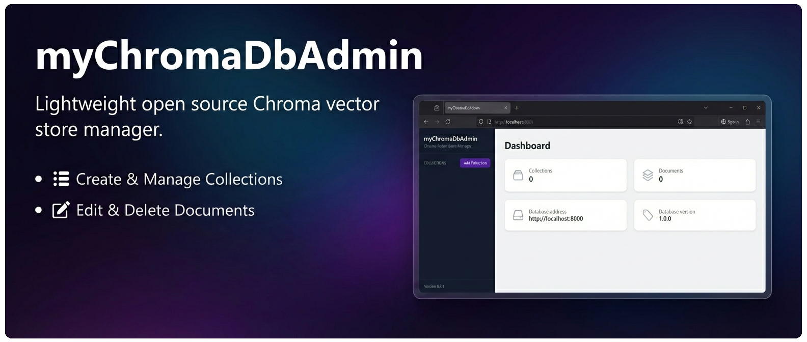

# myChromaDbAdmin

**Simple user-friendly Chroma database administration WebUI.**



## Disclaimer
This is an independent personal project not affiliated with or sponsored by [Chroma](https://www.trychroma.com/).

## Overview

The myChromaDbAdmin is a webpage that helps you navigate, manage, and interact with your data stored in the Chroma database.

## Why is it called myChromaDbAdmin?
The name **myChromaDbAdmin** is directly inspired by [phpMyAdmin](https://www.phpmyadmin.net/), a tool I frequently use and admire. Just as phpMyAdmin provides a powerful web interface for managing MySQL/MariaDb databases, this app aims to provide the same ease of use and accessibility for ChromaDB. 🙂

## Prerequisites

- A running instance of Chroma database. You can find installation instructions on the [Chroma GitHub Repository](https://github.com/chroma-core/chroma).

## Features

- View and manage (create, delete, rename) collections and collections metadata in your Chroma database.
- Browse and manage (add, edit, clone, delete) documents content and metadata within collections.
- Integrated user authentication and session management to ensure secure remote access and protected instance hosting.

## Tech Stack

- Frontend: 
    - HTML (EJS)
    - CSS (Tailwind CSS)
    - JavaScript (Alpine.js)
- Backend: 
    - Node.js
    - Express.js
    - Passport.js (Authentication)
    - The Chroma [npm package](https://docs.trychroma.com/docs/overview/getting-started?lang=typescript)

## Motivation
While working with ChromaDb locally, I found that the official TUI client had several limitations: 

- it can only open one collection at a time from a local instance
- it lacks the ability to modify existing collections or documents

I developed this web app to provide a more flexible solution for browsing, inspecting, and managing vector store content directly from a browser.

## Installation

1. Clone the repository and install the dependencies:
   ```bash
    npm install
    ```
2. Build the styling and start the application:
   ```bash
   npm run tailwind:css
   npm run start
   ```
3. Open your web browser and navigate to `http://localhost:3000` to access the myChromaDbAdmin interface.

## Configuration and Security

The application requires two files to manage security and user access:

- environment variables configuration file
- user data configuration file

For enhanced security, configuration and user data are stored in a dedicated `/secrets` directory located outside the application's web-accessible root.

### Environment Variables external configuration file

By default instead of a standard `.env` file, the app looks for a configuration file named `mychromadbadmin.txt`.
This file defines the application's runtime environment:

- `SESSION_SECRET`: a secure string used to sign the session cookie.
- `NODE_ENV`: set to `development` or `production`. Used for example, to ensure secure flags are set in live environments.

### User Data configuration file

Authentication details are stored in a local file named `mychromadbadminusers.json`. Each user object contains:

- `id`: a unique UUID string identifying the user.
- `username`: the name used for sign-in.
- `password`: a secure `bcrypt hash` of the user's password (never stored in plain text).
- `createdAt`: a timestamp indicating when the user account was created.

### File Structure Example

To ensure the app starts correctly, your directory structure should look like this:

```
/secrets
  ├── mychromadbadmin.txt
  └── mychromadbadminusers.json
/myChromaDbAdmin (Project root served by the web server)
  ├── server.js
  ├── package.json
  └── ...
```

> If you prefer a standard setup, these paths can easily be adapted in the source code to use a default `.env` file or an alternative location for the user data (look in `server.js` and `usermanagement.js`).

### Initial User Setup

To enable your first login, create the `mychromadbadminusers.json` file with a default user entry. Below is a template:

```
{
  "users": [
    {
      "id": "f16d0264-5791-4e7e-b101-c92e1271c8bb",
      "username": "mychromadbadmin2",
      "password": "INSERT_BCRYPT_HASH_HERE",
      "createdAt": "2026-05-09T09:58:23.194Z"
    }
  ]
}
```

Create the password hash by running the following command once in your project root directory (ensure dependencies are installed first):

```JavaScript
node -e "console.log(require('bcrypt').hashSync('yourpasswordhere', 10))"
```

## Usage and features

You can find a detailed description and numerous screenshots in the [Documentation](https://github.com/keenthinker/myChromaDbAdmin/blob/main/documentation/Documentation.md) folder.


## Roadmap

The following items outline planned improvements and features for upcoming releases:

- [x] Integrate TailwindCSS properly into the project (MVP is using the CDN)
- [ ] Make the database server address and port configurable
- [ ] Support multiple databases and tenants (not limited to defaults)
- [x] Improve collection ordering in the sidebar (sort alphabetically)
- [x] Fix metadata key/value handling:
  - Allow newly added metadata keys to start empty
  - Metadata key/value pairs sorted alphabetically by key
- [ ] Improve accessibility:
  - Correct tab order
  - Add useful keyboard shortcuts
- [x] Implement user management (1): login/authentication
- [ ] Implement user management (2): basic access control (e.g. restrict users to specific collections)
- [ ] Add internationalization (i18n) and translation support


## Feedback, Issues and Support

I'd love to hear your honest feedback on the app, positive or critical, and the reasons behind it. Feedback, questions, and ideas are very welcome. 🙂

- For bugs, feature requests, or concrete improvements, please use [GitHub Issues](https://github.com/keenthinker/myChromaDbAdmin/issues) so everything stays transparent and trackable.
- If you have feedback, general questions, need help with a specific setup, or prefer a more direct conversation, feel free to reach out to me outside of GitHub as well.


## Contributing

Contributions are welcome! Please fork the repository and submit a pull request.

## License

The myChromaDbAdmin is licensed under the [MIT License](LICENSE). Feel free to use and modify it according to your needs.