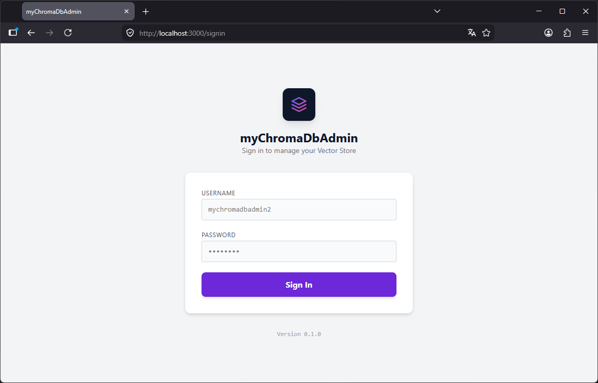
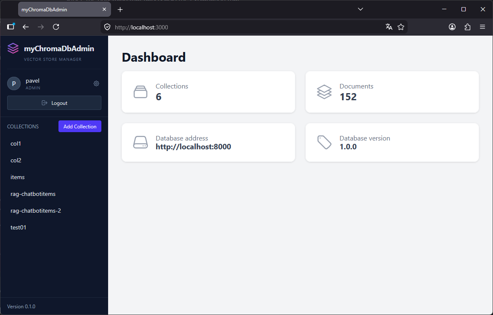

## Authentication

Access to the management interface is secured via a dedicated sign-in page.

Users must authenticate with their credentials to access the vector store instance. The login screen features a secure entry point and provides immediate feedback in case of incorrect credentials.

## Usage and features

The home screen consists currently of two main areas:

- Sidebar (left): displays a list of all available collections.
- Main panel (right): displays the dashboard, document lists, and configuration dialogs. 

Upon loading, the application defaults to the Dashboard, witch provides a high-level overview of the connected instance. 

### Sidebar

The sidebar serves as the primary navigation hub. It displays a list of all available collections and includes a **User** section at the top for account management:

- User Profile: displays the currently logged-in username and their administrative role.
- Settings: accessible via the gear icon adjacent to the username; this menu allows for managing profile details and application configurations (currently only a placeholder).
- Logout: A button to logout from the current session and return to the sign-in page.
- At the very bottom of the sidebar, the **Version** label indicates the current release of the application to help you ensure you are running the latest build.

### Managing collections

To create a new collection use the **create collection** dialog.

You can modify an existing collection to rename it or update its metadata.

**Please note:** *The distance function (space configuration) can only be set during creation. It cannot be changed once the collection has been created.*

### Viewing documents

When you select a collection from the sidebar, the main panel displays all documents within that collection.

If the selected collection contains no data, the list will appear empty.

### Adding and Editing Documents

Documents can be added manually to any collection. Please note that embeddings are generated automatically by the server; they cannot be manually specified or edited.

Existing documents can be modified at any time. 

### Navigation and error handling

The paging functionality allows you to navigate through all documents if a collection contains more than 10 entries.

The following is an example of a populated dashboard showing an instance with multiple collections and documents:

If an unexpected issue occurs - such as the Chroma instance becoming unavailable - an error message will be displayed. 

